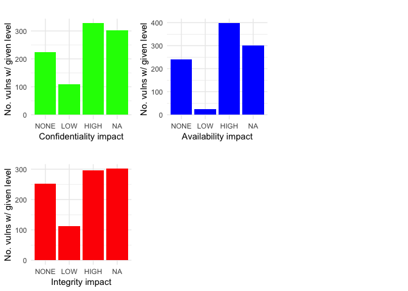
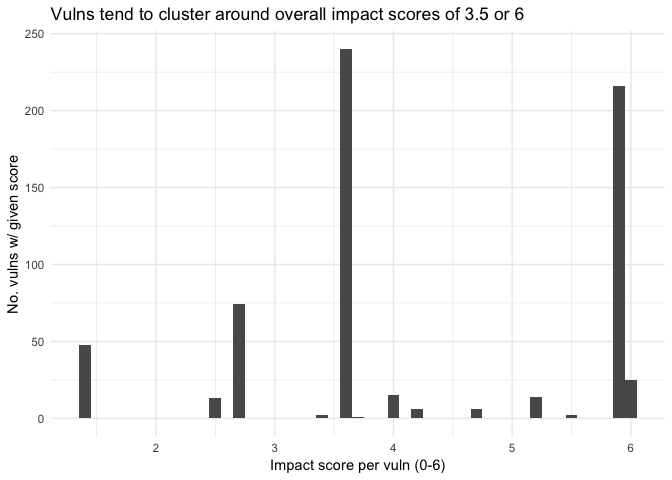
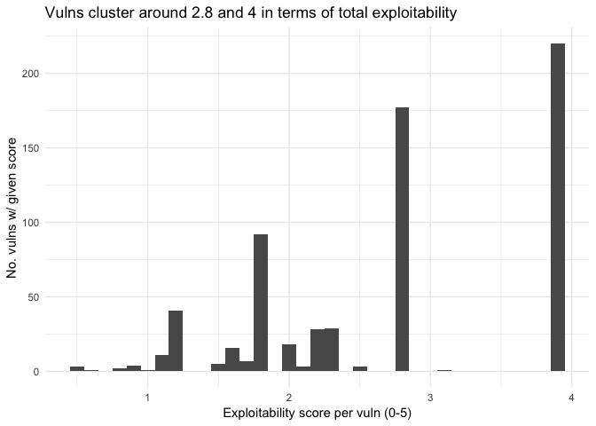
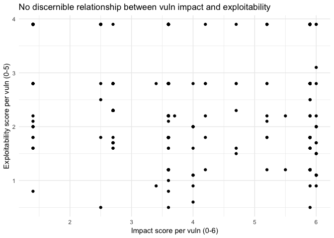
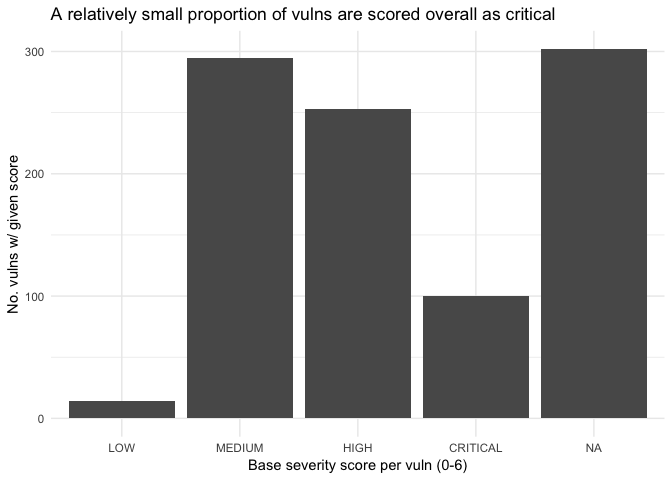
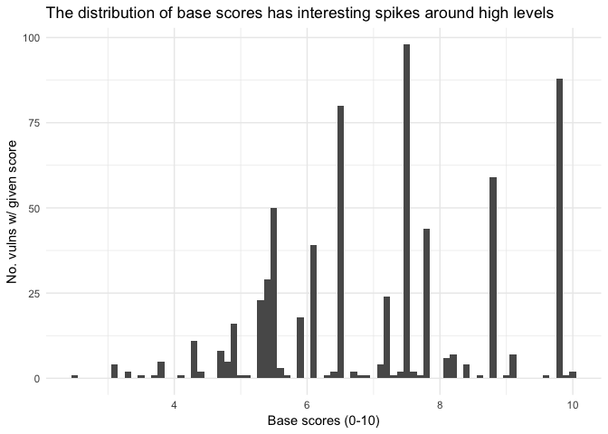
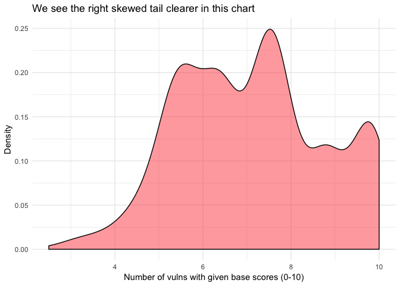
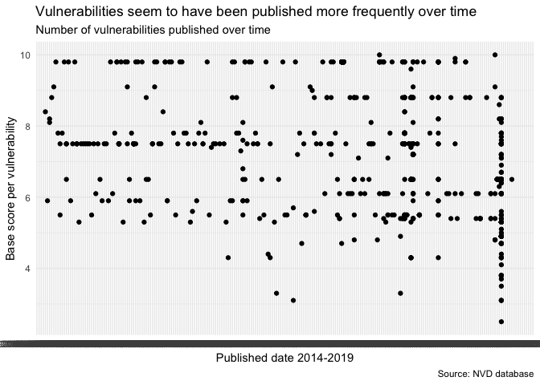

# Analysing the NVD database to understand the distribution and severity of vulnerabilities
Benjamin C. Dean  

This workbook analyzes data from the National Vulnerability Database (NVD) (https://nvd.nist.gov), which is the U.S. government repository of standards based vulnerability management data represented using the Security Content Automation Protocol (SCAP). The NVD includes databases of security checklist references, security-related software flaws, misconfigurations, product names, and impact metrics.

This latter feature, impact metrics, uses the Common Vulnerability Scoring System (CVSS) to score the impact and severity of each vulnerability. Categorizing vulnerabilities by their relative severity (i.e. of what nature and how serious would the consequences be if the vulnerability were to be exploited) can be useful for our digital defects project. By exploring the NVD and examining the distribution of the known vulnerabilities we are able to better inform efforts to apply the legal concept of 'defects' to these technologies. While it may be true that it is 'difficult to write bug free code' or that 'not all bugs can be known ahead of time', that does not mean that there are known critical vulnerabilities that should be fixed before these technologies are shipped. Identifying the frequency of these vulnerabiltiies appearing helps us set a severity threshold at which a vulnerability would render a product defective. 

To start with we import a series of libraries and create a few functions to permit analysis and visualization of the NVD dataset.


### Importing the dataset  
We then need to import the dataset. This is a JSON format dataset, which requires us to flatten it into a dataframe and to extract the 'CVE_Items' characteristics of each vulnerability as this is our are of interest. For those not yet in possession of the dataset - it can be downloaded here: https://nvd.nist.gov/vuln/data-feeds#JSON_FEED


We end up with a dataframe containing 44 characteristics for each vulnerability and 964 listed vulnerabilities (i.e. 44 columns and 964 rows). The NVD uses two versions of the Common Vulnerability Scoring System (CVSS) - v3 and v2. More information about the differences between these two versions can be found here (https://nvd.nist.gov/vuln-metrics/cvss).

For this analysis, we are going to focus on the variables related to v3 of the CVSS. The aggregate scores calculated using the CVSS have been criticized (https://resources.sei.cmu.edu/asset_files/WhitePaper/2018_019_001_538372.pdf), as is often the case for any score or index that attempts to bring together a variety of different metrics, so we are going to break up and explore the composite parts of the scores, which have a better reputation in the field (https://seclists.org/dailydave/2019/q1/16).  

These variables include:  
- cve.CVE_data_meta.ID

- impact.baseMetricV3.exploitabilityScore
- impact.baseMetricV3.impactScore*
- impact.baseMetricV3.cvssV3.attackComplexity
- impact.baseMetricV3.cvssV3.confidentialityImpact
- impact.baseMetricV3.cvssV3.integrityImpact
- impact.baseMetricV3.cvssV3.availabilityImpact
- impact.baseMetricV3.cvssV3.baseScore
- impact.baseMetricV3.cvssV3.baseSeverity*

Throughout this analysis a brief explanation for each variable will be provided when appropriate. For a full description of the variables see (https://www.first.org/cvss/specification-document).  


### Exploitability and impact of vulnerabilities
To begin let us take a look at the exploitability and impact variables. The The Impact metrics reflect the direct consequence of a successful exploit, and represent the consequence to the thing that suffers the impact, which we refer to formally as the impacted component.

The three impact variables - confidentiality, integrity and availability - have been cleaned (i.e. changed from categorical variables to a factor variable with levels). They can then can be plotted alongside one another to see if there are any noteworthy aspects to the distribution. Across all three variables we see that around 1/3 of the known vulnerabilities have a 'High' impact rating. 

<!-- -->

We might wish to understand what proportion of those vulnerabilities have a 'High' rating across all three impact categories. This would single them out as particularly serious and good candidates to be considered defects.  

To do this we subset for only vulnerabilities with a 'High' rating in all three impact categories, which singles out 241 vulnerabilities. Given that we know around 300 vulnerabilities are considered 'High' for at least one impact category, this implies that roughly 80% of 'High' impact vulnerabilities for one impact category will be considered 'High' across all (i.e. very serious). 


```r
high <- subset(data, impact.baseMetricV3.cvssV3.confidentialityImpact == "HIGH" & impact.baseMetricV3.cvssV3.integrityImpact == "HIGH" & impact.baseMetricV3.cvssV3.availabilityImpact == "HIGH")

dim(high)
```

```
## [1] 241  44
```

The dataset helpfully provides a variable called 'impact score', which appears to be a composite of the three individual impact scores where 0 = 'None', 1 = 'Low' and 2 = 'High'. Looking at this chart we can see the relative distribution across all vulnerabilities with a spike at '6' (i.e. high, high, high). 

<!-- -->

### Exploitability metrics
Exploitability metrics reflect the ease and technical means by which the vulnerability can be exploited. That is, they represent characteristics of the thing that is vulnerable.

We might wish to understand which vulnerabilities are more easily exploited as this would help with our prioritization and application of the legal defects concept. The idea is that the more easily a known vulnerability could be exploited - the more likely that it would be considered a defect.

The exploitability composite measure from 0-5 and includes: attack complexity [low/high], privleges required [none/low/high] and user interaction [none/required]. Being a composite measure - it is not the best metric - but does help us understand a little better the underlying distribution.

We see that over 200 vulnerabiities have an exploitability score of 5, which would classify them as the most serious vulnerabilities by this measure. 

<!-- -->

### Relationship between impact and exploitability
Now that we've gone through each of the impact and exploitability metrics, is there a relationship between then? We can potentially answer this question using a scatter plot. 

Looking at the scatter plot we don't see any noticable relationship. We could do a quick check by running a linear regression, which yields a statistically non-significant result.

<!-- -->

### Base severity score (discrete)
The CVSS provides what is called a 'base' severity score output, which takes the values for the following variables but does not adjust them to the temporal and environmental factors of the network/system in question:

- Attack Vector, AV 
- Attack Complexity, AC 
- Privileges Required, PR 
- User Interaction, UI 
- Scope, S 
- Confidentiality, C 
- Integrity, I 
- Availability, A

Being a discrete variable, the severity score has to first be turned into a factor [it is coded as low, medium, high and critical'] and then levels given to the values. We can then plot the output on a bar graph. 

We see that a small proportion of all vulnerabiltiies (~100 or 8%) are deemed 'Critical'. 

<!-- -->

### Base severity score (continuous)
The base score is also provided as a continuous variable between 0-10. This gives us some more analytical options. First let's examine the distribution of the scores. We can use the describe() function to retrieve the statistics. 

We find that the mean and the median are close to one another, which would suggest a normal distribution. The low skew and kurtosis further support this inference. 

If we do a histogram though we see that there are clusters around the approximate values of 6.2, 7.8, 8.4 and 9.9. The latter grouping corresponds to the 'critical' designation from the discrete score above. By overlaying a density plot we are able to see the distribution of vulnerabilities by base score. The noteworthy element is that the right tail of the distribution is quite large - certainly larger than one would find with a normal distribution. 


<!-- -->


We're partially interested in the probability that a vulnerability will be critical or not (given the empirical sample, which isn't ideal). Below is a density plot that shows clearly the right skew of the dataset. The percentiles are also calculated in a table below.

<!-- -->

```
##    1%   10%   20%   33%   50%   66%   90%   99% 
## 3.422 5.300 5.500 6.100 7.200 7.500 9.800 9.800
```

Now that we've identified the 'critical' subset of vulnerabilities, let's take a deeper look to see what they have in common. The first thing we can do is extract the vendor whose software possesses the vulnerability and see if there's any over-represented companies.

Below the first 20 companies, by frequency of vulnerabilities, is displayed. 


```
##                    x freq
## 116           oracle  142
## 42            debian   83
## 128           redhat   55
## 59            google   54
## 98         microsoft   46
## 155        wireshark   46
## 27         canonical   34
## 8              apple   27
## 107              nec   21
## 7             apache   13
## 93             linux   12
## 94            macpaw   11
## 140      technicolor   10
## 39            cybozu    9
## 57               gnu    9
## 114          openssl    9
## 122 pivotal_software    8
## 51         fasterxml    7
## 65               ibm    7
## 61              haxx    6
```

We can do this again to get the top 20 products, by frequency of vulnerabilities. 


```
##                                     x freq
## 52                             chrome   53
## 325                         wireshark   46
## 310                     vm_virtualbox   27
## 317                        windows_10   27
## 323               windows_server_2016   26
## 324               windows_server_2019   26
## 211                             mysql   25
## 227             outside_in_technology   25
## 319                       windows_8.1   18
## 320                    windows_rt_8.1   18
## 322               windows_server_2012   18
## 165                         iphone_os   16
## 318                         windows_7   16
## 321               windows_server_2008   16
## 196                          mac_os_x   14
## 233 peoplesoft_enterprise_peopletools   13
## 13                           apple_tv   11
## 54                       cleanmymac_x   11
## 193                      linux_kernel    9
## 17             aterm_hc100rc_firmware    8
```
### Rate at which vulns are published over time
Out of interest - have there been more vulnerabilities published over time? If we plot the dates that the vulns are published we can see. We can also put these values in a table to see that a substantially larger number of vulns were published in 2019 than any other year. 

<!-- -->
